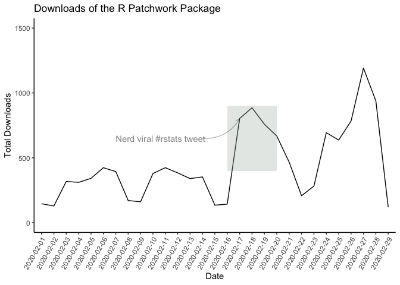
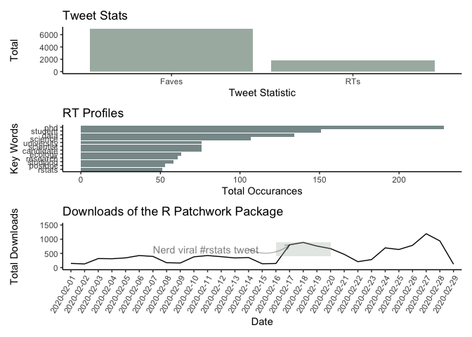
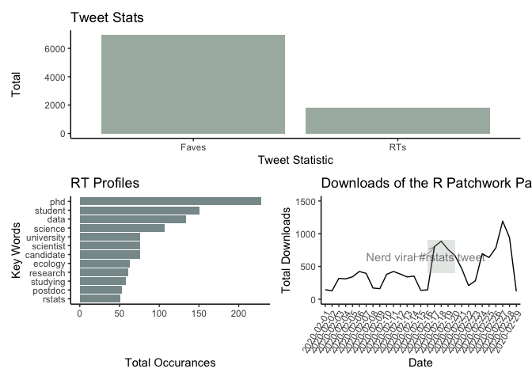
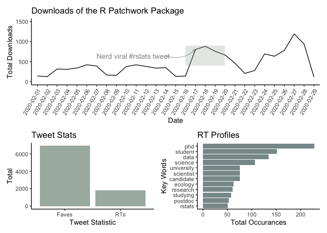
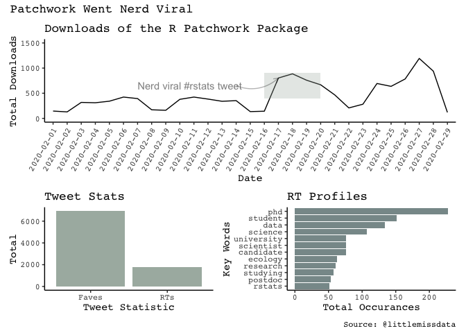

Set Up
======

Install and load all the packages
---------------------------------

Thank you to “Dusty” who posted the package “easypackages” on my [last
tutorial](https://www.littlemissdata.com/blog/bacheloranalysis)

``` r
#install.packages("easypackages")
library(easypackages)
packages("tidyverse", "rtweet", "tidytext", "rtweet", "patchwork", "cran.stats", "data.table", 
         "gameofthrones", "ggimage", "magick", "ggpubr", "jpeg", "png")
```

    ## Loading required package: tidyverse

    ## ── Attaching packages ──────────────────────────────────────────────────────────────── tidyverse 1.2.1 ──

    ## ✓ ggplot2 3.2.1     ✓ purrr   0.3.3
    ## ✓ tibble  2.1.3     ✓ dplyr   0.8.3
    ## ✓ tidyr   1.0.0     ✓ stringr 1.4.0
    ## ✓ readr   1.3.1     ✓ forcats 0.4.0

    ## ── Conflicts ─────────────────────────────────────────────────────────────────── tidyverse_conflicts() ──
    ## x dplyr::filter() masks stats::filter()
    ## x dplyr::lag()    masks stats::lag()

    ## Loading required package: rtweet

    ## 
    ## Attaching package: 'rtweet'

    ## The following object is masked from 'package:purrr':
    ## 
    ##     flatten

    ## Loading required package: tidytext

    ## Loading required package: patchwork

    ## Loading required package: cran.stats

    ## Loading required package: data.table

    ## 
    ## Attaching package: 'data.table'

    ## The following objects are masked from 'package:dplyr':
    ## 
    ##     between, first, last

    ## The following object is masked from 'package:purrr':
    ## 
    ##     transpose

    ## Loading required package: gameofthrones

    ## Loading required package: ggimage

    ## Loading required package: magick

    ## Linking to ImageMagick 6.9.9.39
    ## Enabled features: cairo, fontconfig, freetype, lcms, pango, rsvg, webp
    ## Disabled features: fftw, ghostscript, x11

    ## Loading required package: ggpubr

    ## Loading required package: magrittr

    ## 
    ## Attaching package: 'magrittr'

    ## The following object is masked from 'package:purrr':
    ## 
    ##     set_names

    ## The following object is masked from 'package:tidyr':
    ## 
    ##     extract

    ## 
    ## Attaching package: 'ggpubr'

    ## The following object is masked from 'package:ggimage':
    ## 
    ##     theme_transparent

    ## Loading required package: jpeg

    ## Loading required package: png

    ## All packages loaded successfully

Set up our colour palette
-------------------------

Using the beautiful Game of Thrones color palette from [Alejandro
Jiménez](https://twitter.com/aljrico) in his [“gameofthrones”
package.](https://github.com/aljrico/gameofthrones). Thank you to [Divya
Seernani](https://twitter.com/DSeernani) for sharing!

``` r
#Set the palette using the beautiful GOT Arya palette from Alejandro Jiménez
pal <- got(20, option = "Arya")

#cherry pick a few extended
c <-"#889999"
c2 <- "#AAB7AF"
```

Add your twitter credentials
----------------------------

Create your twitter authentication token by following the steps in
[Michael Kearneys](https://mikewk.com/) [beautiful
documentation](https://rtweet.info/articles/auth.html). Replace the “ADD
YOUR CREDS” with your own credentials.

``` r
#create_token(
#  app = "ADD YOUR CREDS",
#  consumer_key = "ADD YOUR CREDS",
#  consumer_secret = "ADD YOUR CREDS")
```

Create Plots
============

1st Plot - Create a plot of the tweet stats (favorites, retweets)
-----------------------------------------------------------------

### Lookup the tweet and view stats

``` r
lt <-lookup_tweets('1229176433123168256')
lt
```

    ## # A tibble: 1 x 90
    ##   user_id status_id created_at          screen_name text  source
    ##   <chr>   <chr>     <dttm>              <chr>       <chr> <chr> 
    ## 1 205098… 12291764… 2020-02-16 22:51:13 LittleMiss… "😱 H… Twitt…
    ## # … with 84 more variables: display_text_width <dbl>,
    ## #   reply_to_status_id <lgl>, reply_to_user_id <lgl>,
    ## #   reply_to_screen_name <lgl>, is_quote <lgl>, is_retweet <lgl>,
    ## #   favorite_count <int>, retweet_count <int>, quote_count <int>,
    ## #   reply_count <int>, hashtags <list>, symbols <list>, urls_url <list>,
    ## #   urls_t.co <list>, urls_expanded_url <list>, media_url <list>,
    ## #   media_t.co <list>, media_expanded_url <list>, media_type <list>,
    ## #   ext_media_url <list>, ext_media_t.co <list>,
    ## #   ext_media_expanded_url <list>, ext_media_type <chr>,
    ## #   mentions_user_id <list>, mentions_screen_name <list>, lang <chr>,
    ## #   quoted_status_id <chr>, quoted_text <chr>, quoted_created_at <dttm>,
    ## #   quoted_source <chr>, quoted_favorite_count <int>,
    ## #   quoted_retweet_count <int>, quoted_user_id <chr>,
    ## #   quoted_screen_name <chr>, quoted_name <chr>,
    ## #   quoted_followers_count <int>, quoted_friends_count <int>,
    ## #   quoted_statuses_count <int>, quoted_location <chr>,
    ## #   quoted_description <chr>, quoted_verified <lgl>,
    ## #   retweet_status_id <chr>, retweet_text <chr>,
    ## #   retweet_created_at <dttm>, retweet_source <chr>,
    ## #   retweet_favorite_count <int>, retweet_retweet_count <int>,
    ## #   retweet_user_id <chr>, retweet_screen_name <chr>, retweet_name <chr>,
    ## #   retweet_followers_count <int>, retweet_friends_count <int>,
    ## #   retweet_statuses_count <int>, retweet_location <chr>,
    ## #   retweet_description <chr>, retweet_verified <lgl>, place_url <chr>,
    ## #   place_name <chr>, place_full_name <chr>, place_type <chr>,
    ## #   country <chr>, country_code <chr>, geo_coords <list>,
    ## #   coords_coords <list>, bbox_coords <list>, status_url <chr>,
    ## #   name <chr>, location <chr>, description <chr>, url <chr>,
    ## #   protected <lgl>, followers_count <int>, friends_count <int>,
    ## #   listed_count <int>, statuses_count <int>, favourites_count <int>,
    ## #   account_created_at <dttm>, verified <lgl>, profile_url <chr>,
    ## #   profile_expanded_url <chr>, account_lang <lgl>,
    ## #   profile_banner_url <chr>, profile_background_url <chr>,
    ## #   profile_image_url <chr>

### Create a chart with the tweet stats

``` r
p1 <- lt %>% 
  rename(Faves = favorite_count, RTs = retweet_count) %>% 
  select(Faves, RTs) %>%  #select only the desired columns
  gather("stat", "value") %>%  #reformat to make the table long which is easier for bar charts to consume
  ggplot(aes(stat, value)) +  #plot the bar chart
  geom_bar(stat="identity", fill=c2) +
  theme_classic() + 
  labs(title = "Tweet Stats",
                           x = "Tweet Statistic", y = "Total")  

p1
```


2nd Plot - Create a plot of the tweet stats (favorites, retweets)
-----------------------------------------------------------------

### Gather approx 1K of the retweet data

The [get\_retweets()](https://rtweet.info/reference/get_retweets.html)
function only allows a max of 100 retweets to be pulled via the API at a
time. This is a rate imposed by the twitter API. When pulling this data,
I had quite a difficult time. Not only, did a lot of the suggested
methods to getting cursors fail, the rate limiting wasn’t consistent.
Sometimes I was able to get close to 1K tweets in 100 batches. Sometimes
it blocked me for 15 min intervals (as expected). Since this is just an
example to show patchwork, I decided to just grab 1K of the retweets
which is roughly half of the full set of retweets. Further, I should let
you know that I did attempt to put it in a function, but I couldn’t find
an appropriate system wait time that would complete in a reasonable time
and/or actually return the data. Please reach out if you have a
better/proven method! In the meantime, here is my brute force method.

``` r
statusid <- '1229176433123168256' #set the first lowest retweet statusid to be the id of the original tweet
rtweets <- get_retweets(statusid, n=100, parse = TRUE) # get 100 retweets
min_id <- min(rtweets$status_id)

rtweets2 <- get_retweets(statusid, n=100, max_id = min_id, parse = TRUE) # get 100 retweets
min_id <- min(rtweets2$status_id)

rtweets3 <- get_retweets(statusid, n=100, max_id = min_id, parse = TRUE) # get 100 retweets
min_id <- min(rtweets3$status_id)

rtweets4 <- get_retweets(statusid, n=100, max_id = min_id, parse = TRUE) # get 100 retweets
min_id <- min(rtweets4$status_id)

rtweets5 <- get_retweets(statusid, n=100, max_id = min_id, parse = TRUE) # get 100 retweets
min_id <- min(rtweets5$status_id)

rtweets6 <- get_retweets(statusid, n=100, max_id = min_id, parse = TRUE) # get 100 retweets
min_id <- min(rtweets6$status_id)

rtweets7 <- get_retweets(statusid, n=100, max_id = min_id, parse = TRUE) # get 100 retweets
min_id <- min(rtweets7$status_id)

rtweets8 <- get_retweets(statusid, n=100, max_id = min_id, parse = TRUE) # get 100 retweets
min_id <- min(rtweets8$status_id)

rtweets9 <- get_retweets(statusid, n=100, max_id = min_id, parse = TRUE) # get 100 retweets
min_id <- min(rtweets9$status_id)

rtweets10 <- get_retweets(statusid, n=100, max_id = min_id, parse = TRUE) # get 100 retweets
min_id <- min(rtweets10$status_id)

rtweet_table <-rbind(rtweets, rtweets2, rtweets3, rtweets4, rtweets5, rtweets6, rtweets7, rtweets8, rtweets9, rtweets10)
nrow(rtweet_table)
```

    ## [1] 961

``` r
length(unique(rtweet_table$description))
```

    ## [1] 879

### Graph the most common words used in the retweeters profile descriptions

Most of the techniques used below to process the data and graph the data
are taken from the [tidy text mining](https://www.tidytextmining.com/)
book by [Julia Silge](https://twitter.com/juliasilge) and [David
Robinson](https://twitter.com/drob)

``` r
data(stop_words)
#Unnest the words - code via Tidy Text
rtweet_table2 <- rtweet_table %>% 
  unnest_tokens(word, description) %>% 
  anti_join(stop_words) %>% 
  count(word, sort = TRUE) %>%
  filter(!word %in% c('t.co', 'https'))
```

    ## Joining, by = "word"

``` r
p2 <- rtweet_table2 %>%
  filter(n> 50) %>%
  mutate(word = reorder(word, n)) %>%
  ggplot(aes(word, n)) +
  theme_classic() +
  geom_col(fill= c) +
  labs(title = "RT Profiles",
       x = "Key Words", y = "Total Occurances")  +
  coord_flip() 

p2
```


3rd Plot - Plot the patchwork CRAN download stats
-------------------------------------------------

### Gather the data

To download the patchwork download stats, I used the [“cran.stats”
package](https://www.rdocumentation.org/packages/cran.stats/versions/0.1).
The examples to process the download stats were very easy and I just
followed the [examples
here](https://cran.r-project.org/web/packages/dlstats/vignettes/dlstats.html#download-stats-of-cran-packages).

``` r
dt = read_logs(start = as.Date("2020-02-01"), 
               end = as.Date("2020-02-29"), 
               verbose = TRUE)
```

    ## 
    Fread(ing) logs    1 of 29 - 2020-02-01.csv (3%)
    Fread(ing) logs    2 of 29 - 2020-02-02.csv (7%)
    Fread(ing) logs    3 of 29 - 2020-02-03.csv (10%)
    Fread(ing) logs    4 of 29 - 2020-02-04.csv (14%)
    Fread(ing) logs    5 of 29 - 2020-02-05.csv (17%)
    Fread(ing) logs    6 of 29 - 2020-02-06.csv (21%)
    Fread(ing) logs    7 of 29 - 2020-02-07.csv (24%)
    Fread(ing) logs    8 of 29 - 2020-02-08.csv (28%)
    Fread(ing) logs    9 of 29 - 2020-02-09.csv (31%)
    Fread(ing) logs    10 of 29 - 2020-02-10.csv (34%)
    Fread(ing) logs    11 of 29 - 2020-02-11.csv (38%)
    Fread(ing) logs    12 of 29 - 2020-02-12.csv (41%)
    Fread(ing) logs    13 of 29 - 2020-02-13.csv (45%)
    Fread(ing) logs    14 of 29 - 2020-02-14.csv (48%)
    Fread(ing) logs    15 of 29 - 2020-02-15.csv (52%)
    Fread(ing) logs    16 of 29 - 2020-02-16.csv (55%)
    Fread(ing) logs    17 of 29 - 2020-02-17.csv (59%)
    Fread(ing) logs    18 of 29 - 2020-02-18.csv (62%)
    Fread(ing) logs    19 of 29 - 2020-02-19.csv (66%)
    Fread(ing) logs    20 of 29 - 2020-02-20.csv (69%)
    Fread(ing) logs    21 of 29 - 2020-02-21.csv (72%)
    Fread(ing) logs    22 of 29 - 2020-02-22.csv (76%)
    Fread(ing) logs    23 of 29 - 2020-02-23.csv (79%)
    Fread(ing) logs    24 of 29 - 2020-02-24.csv (83%)
    Fread(ing) logs    25 of 29 - 2020-02-25.csv (86%)
    Fread(ing) logs    26 of 29 - 2020-02-26.csv (90%)
    Fread(ing) logs    27 of 29 - 2020-02-27.csv (93%)
    Fread(ing) logs    28 of 29 - 2020-02-28.csv (97%)
    Fread(ing) logs    29 of 29 - 2020-02-29.csv (100%)

``` r
dim(dt)
```

    ## [1] 124780684         5

``` r
patchwork <- stats_logs(dt, type="daily", packages=c("patchwork"), 
                        dependency=TRUE, duration = 30L)
```

### Plot the CRAN download data

Using the ggplot, geom\_line() function with just a little extra
fancyness to annotate the graph with the annotate() function. Great
annotation examples
[here](https://ggplot2.tidyverse.org/reference/annotate.html)

``` r
p3 <- ggplot(patchwork, aes(x=key, y=tot_N, group=1)) +
  geom_line() + theme_classic() + theme(axis.text.x = element_text(angle = 60, hjust = 1)) +
  ylim(0, 1500) + 
  labs(title = "Downloads of the R Patchwork Package",
       x = "Date", y = "Total Downloads") + 
  annotate("rect", xmin = "2020-02-16", xmax = "2020-02-20", ymin = 400, ymax = 900,
           alpha = .3, fill = c2)  +
  annotate(
    geom = "curve", alpha = 0.3, x = "2020-02-14", y = 650, xend = "2020-02-17", yend = 800, 
    curvature = .3, arrow = arrow(length = unit(2, "mm"))
  ) +
  annotate(geom = "text", x = "2020-02-07", y = 650, label = "Nerd viral #rstats tweet", hjust = "left", alpha = 0.5)

p3
```



Add the plots to the same graphic using patchwork
=================================================

As is the focus of this post, when this package was [shared on
twitter](https://twitter.com/LittleMissData/status/1229176433123168256),
people were very excited about it. The [patchwork
package](https://github.com/thomasp85/patchwork) was created by [Thomas
Lin Pedersen](https://twitter.com/thomasp85). Not only is it incredibly
easy to use, it comes with great
[documentation](https://patchwork.data-imaginist.com/index.html)

Try a few layouts
-----------------

Using the plots p1, p2, p3 created above, try a few layouts following
the package documentation

``` r
p1/p2/p3
```



``` r
p1 + p2 + p3
```


``` r
p1/ (p2 +p3)
```



``` r
#Final Layout
p <- p3 / (p1 + p2)
p
```



Annotate the final layout
-------------------------

We will select the final layout from the above code block and then add
some overall titles, captioning and formatting. This example was covered
in the excellent [patchwork annotation
guide](https://patchwork.data-imaginist.com/articles/guides/annotation.html)

``` r
# Change the values for the labels
# Overall annotation

p + plot_annotation(
  title = 'Patchwork Went Nerd Viral',
  caption = 'Source: @littlemissdata'
) 
```


``` r
p + plot_annotation(
  title = 'Patchwork Went Nerd Viral',
  caption = 'Source: @littlemissdata'
) & 
  theme(text = element_text('mono'))
```



Add an image to the patchwork graphic
=====================================

Bring in the image
------------------

Using an empty plot and the background\_image() function, you can bring
an image into a graph object. Further, you can prevent image resizing
with the coord\_fixed() function. This is important so the actual image
doesn’t get resized with the patchwork placement.

``` r
## Add an image

twitter <- image_read('https://raw.githubusercontent.com/lgellis/MiscTutorial/master/Patchwork/twitter_post.png')
twitter <- ggplot() +
  background_image(twitter) + coord_fixed()
```

Plot the image with patchwork
-----------------------------

``` r
(twitter + p3) / (p1 + p2 )
```


``` r
pF <- twitter + (p3/ (p1 + p2))

pF + plot_annotation(
  title = 'Patchwork Went Nerd Viral',
  caption = 'Source: @littlemissdata'
) & 
  theme(text = element_text(family ='mono', size = 9))
```


